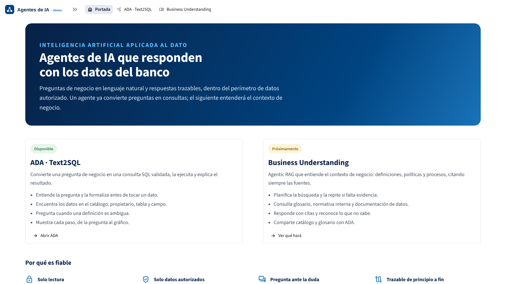
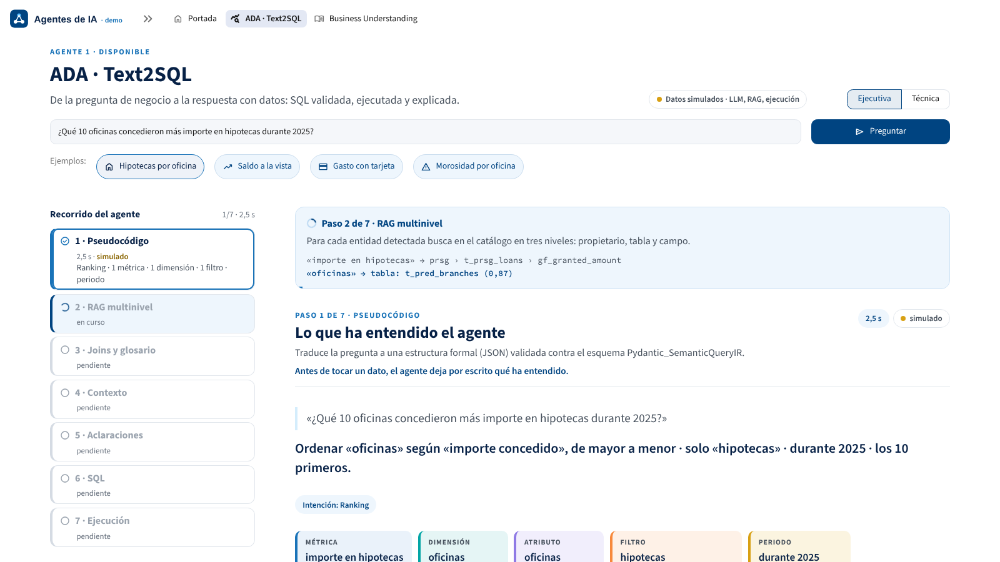
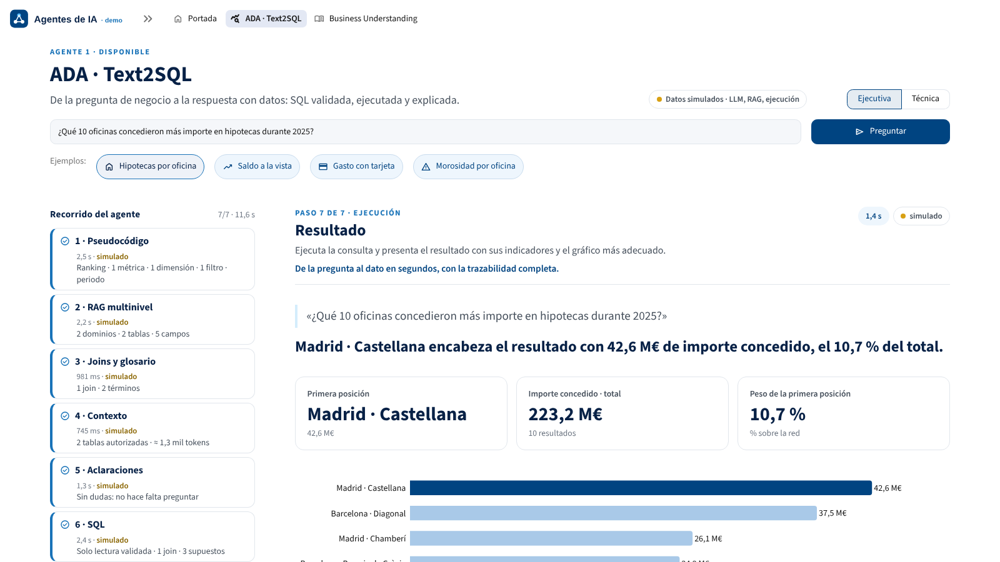
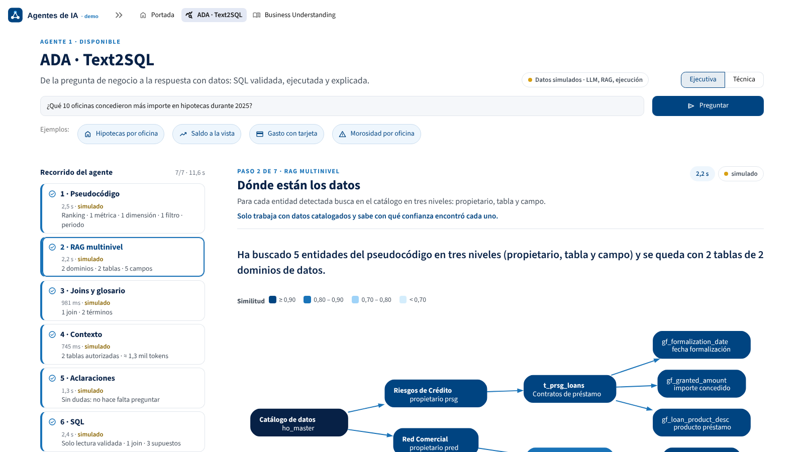
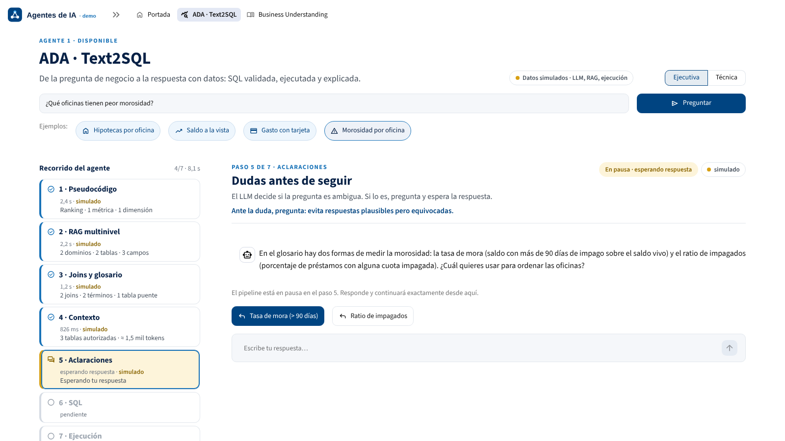

# Demo de agentes de IA · ADA Text2SQL y Business Understanding

Dashboard en Streamlit para presentar dos agentes de IA a la dirección:

- **ADA · Text2SQL**: convierte una pregunta de negocio en SQL validada, la ejecuta y explica el resultado. El pipeline de 7 pasos se despliega paso a paso ante la audiencia.
- **Business Understanding**: agentic RAG para el contexto de negocio. Página «Próximamente» con la descripción y el flujo previsto.

| Portada | ADA en curso |
|---|---|
|  |  |

| Resultado | RAG multinivel | Aclaración |
|---|---|---|
|  |  |  |

## Arranque

Requisitos: Python 3.11 o superior (probado en 3.13).

```bash
cd demo_agentes
python -m venv .venv
source .venv/bin/activate          # Windows: .venv\Scripts\activate
pip install -r requirements.txt
streamlit run app.py
```

Se abre en <http://localhost:8501>. Lanza siempre `streamlit run` desde `demo_agentes/`, porque ahí está `.streamlit/config.toml` con el tema.

- **Datos simulados:** se generan la primera vez (unos 10 s) y se guardan en `data/mock/.cache/`. Los arranques siguientes tardan menos de un segundo.
- **Sin red ni credenciales:** el modo simulado funciona sin conexión y no necesita AWS.

### Modo real (Bedrock, tu RAG, Athena)

```bash
pip install -r requirements-aws.txt
# Credenciales AWS (perfil o SSO) con acceso a Bedrock en eu-south-2 y a Athena
ADA_AGENT=bedrock streamlit run app.py
```

Cada servicio se elige por separado:

| Servicio | `config/settings.toml` | Variable de entorno | Valores |
|---|---|---|---|
| LLM (pasos 1, 5 y 6) | `services.agent` | `ADA_AGENT` | `mock` · `bedrock` |
| RAG (paso 2) | `services.rag` | `ADA_RAG` | `mock` · `agent` (tu `retrieve_context_for_sql`) |
| Ejecución (paso 7) | `services.executor` | `ADA_EXECUTOR` | `mock` (DuckDB) · `athena` |
| Ritmo de la animación | `demo.speed` | `ADA_SPEED` | `0` instantáneo · `1` realista |
| Avance automático | `demo.autoplay` | `ADA_AUTOPLAY` | `true` · `false` (modo presentador) |

- **Durante la demo:** la barra lateral (plegada, flecha `»` arriba a la izquierda) permite cambiar todo lo anterior. Los servicios se fijan al lanzar cada pregunta; el avance y el ritmo cambian al momento.
- **Combinación más probable para el directo:** LLM real con RAG y ejecución simulados. El LLM recibe el catálogo bancario sintético, escribe SQL sobre él y DuckDB la ejecuta de verdad, así que también funcionan preguntas libres.

## Cómo se conecta con tu código

Tu código está en `agents/ada_text2sql/`, sin cambios de lógica:

- `semantic_ir.py` es tu clase `Pydantic_SemanticQueryIR`, literal.
- `agent.py` es tu grafo y tus nodos. Solo se ha añadido:
  - la cabecera de imports;
  - las comillas de cierre del string `table`, que llegó cortado en el fragmento.
- `ejemplo_cli.py` es tu bloque de lanzamiento por terminal, movido aquí para que importar el módulo no ejecute el grafo ni pida `input()`. Se ejecuta con `python -m agents.ada_text2sql.ejemplo_cli`.
- `prompts.py` contiene un **`prompt_semantic_ir_outbound` provisional**, redactado a partir de los comentarios del modelo. **Sustitúyelo por el tuyo.**

El orquestador no llama a `sql_agent_graph` de una sola vez: invoca tus nodos uno a uno. Así puede intercalar los pasos que no existen en el grafo, medir cada paso y pausar en `st.session_state`.

| Paso | Modo real (tu código) | Modo simulado |
|---|---|---|
| 1 Pseudocódigo | `parse_semantic_query` → `Pydantic_SemanticQueryIR` | IR guionizado (`data/mock/scenarios.yaml`) |
| 2 RAG multinivel | `inject_query_context` → `retrieve_context_for_sql` | Búsqueda propietario → tabla → campo sobre `data/mock/catalog.yaml` |
| 3 Joins y glosario | No existe en el grafo: maqueta con YAML definidos a mano | `data/mock/joins.yaml`, `data/mock/glossary.yaml` |
| 4 Contexto | No existe: se monta el `context` exacto que reciben tus nodos | Igual |
| 5 Aclaraciones | `decide_if_clarification_is_needed` | Guion por escenario |
| 6 SQL | `generate_sql` (incluye tu `validate_read_only_sql`) | SQL guionizada en dialecto Athena |
| 7 Ejecución | `wr.athena.read_sql_query(database="ho_master", workgroup="sandbox", ctas_approach=False)` | DuckDB con datos sintéticos; sqlglot traduce Athena → DuckDB |

Detalles del paso a paso:

- **Pausa de `ask_user`:** tu `interrupt()` lo reproduce la máquina de estados (`core/pipeline.py`) con el mismo contrato: `clarifications = [{"question", "answer"}]` y un máximo de 3.
- **Dialecto:** se fuerza a `AWS Athena (Trino SQL)` (`sql.dialect`). Tu `retrieve_context_for_sql` vigente devolvía `snowflake`.
- **Tokens y prompts reales:** se capturan con un callback de LangChain registrado por variable de contexto. Es el mismo mecanismo que `get_usage_metadata_callback` y no requiere tocar tus nodos.
- **Doble validación de la SQL:** antes de ejecutarla, sqlglot comprueba que es una única sentencia, de solo lectura y sobre tablas autorizadas. Es lo que sugiere el comentario de tu `validate_read_only_sql`.

### Contrato propuesto para el RAG real

Para que el árbol del paso 2 muestre puntuaciones, cada elemento de `schema_context` debería tener esta forma:

```json
{"entity_id": "m1", "owner": "o1dm · Global Markets", "table": "ho_master.t_o1dm_franchise_gm_daily",
 "field": "gf_franch_oper_rslt_amount", "description": "importe franquicia resultado operacion", "score": 0.91}
```

Si no viene así, que es lo que pasa hoy, el adaptador (`services/rag/agent_adapter.py`) construye el árbol a partir del texto de `authorized_tables` (formato `-Description:` / `-Fields:`), sin puntuaciones. El propietario se deduce de la UUAA del nombre de la tabla (`t_o1dm_…` → `o1dm`).

### Joins y glosario definidos a mano

- **Catálogo simulado:** `data/mock/joins.yaml` y `data/mock/glossary.yaml`.
- **Catálogo real:** `data/real/joins.yaml` y `data/real/glossary.yaml`, con ejemplos comentados (por ejemplo, la unión de `t_o1dm_franchise_gm_daily` con `t_nztg_trade_core_information` por ID de operación). Se usan en modo «Tu RAG».

El paso 3 hace tres cosas:
- busca el camino más corto entre las tablas encontradas y añade las intermedias como «tabla puente»;
- incorpora los términos del glosario que aparecen en la pregunta;
- detecta cuándo un mismo concepto tiene varias definiciones. Es lo que provoca, de forma natural, la aclaración de «morosidad».

### Preguntas de ejemplo

`data/mock/scenarios.yaml` contiene las 4 preguntas de los botones:

| Pregunta | Forma | Gráfico |
|---|---|---|
| Hipotecas por oficina | Ranking | Barras |
| Saldo a la vista | Evolución | Líneas |
| Gasto con tarjeta | Distribución | Barras |
| Morosidad por oficina | Pregunta de aclaración | Barras |

En la de morosidad, las dos definiciones dan un líder distinto: Almería · Paseo por tasa de mora y Sevilla · Triana por ratio de impagados.

Para añadir una pregunta, copia un escenario y ajusta su IR, su SQL y sus supuestos. Los tests comprueban que el IR valida y que la SQL usa exactamente las tablas que encuentra el RAG.

## Robustez en directo

- **Errores de servicios reales:** cualquier error de un servicio real (credenciales, red, permisos, JSON inválido del LLM) se muestra como un mensaje cuidado con tres opciones:
  - **Reintentar**;
  - **Continuar con datos simulados**, solo para ese servicio;
  - **Empezar de nuevo**.
- **Límites de tiempo:** cada servicio real tiene un tiempo máximo de espera (`[timeouts]` en `settings.toml`). Pasado ese límite, se ofrece la misma salida.
- **Sin trazas:** nunca se ven trazas en pantalla (`showErrorDetails = "none"`), y la página tiene una red de seguridad final.
- **Reruns:** el pipeline vive en `st.session_state`. Cambiar de vista, pulsar pasos del stepper o navegar entre páginas no lo reinicia.
- **Preguntas libres en modo 100 % simulado:** muestran un aviso amable con los ejemplos, en lugar de un error.

### Guion sugerido para la demo

1. **Portada** (30 s): qué son los agentes y las cuatro garantías.
2. **ADA, vista ejecutiva, «Hipotecas por oficina»:** la audiencia ve avanzar el stepper; termina en el resultado con indicadores, gráfico y explicación.
3. **Vista técnica:** pulsa los pasos 1, 2, 4 y 6 del stepper (JSON validado, árbol con similitudes, contexto exacto enviado al LLM, SQL validada).
4. **«Morosidad por oficina»:** el glosario muestra dos definiciones y el agente pregunta. Responde con un botón y el pipeline continúa desde el paso 5. Repite con la otra respuesta: cambia la oficina líder.
5. **Business Understanding:** lo que viene.

Consejos:

- **Modo presentador:** desactiva «Avance automático» en la barra lateral. Cada paso espera a «Siguiente paso»; la tecla **AvPág** o el mando de presentaciones también avanzan.
- **Antes de empezar:** abre la app una vez (calienta la caché) y ejecuta `pytest`.
- **Zoom:** ajústalo en el navegador de la sala (80–90 % suele bastar en 1080p) para que el resultado quepa sin hacer scroll.
- **Cambios en el código:** reinicia `streamlit run`; Streamlit no recarga los módulos importados con la app en marcha.

## Estructura

```
demo_agentes/
├── app.py                     # entrada: navegación superior, tema y ajustes
├── .streamlit/config.toml     # tema BBVA (Core Blue, Navy, Medium Blue…), sin trazas ni menú de desarrollo
├── config/settings.toml       # mock/real por servicio, dialecto, límites de tiempo, ritmo
├── app_pages/                 # INTERFAZ: portada, ADA, Business Understanding
├── ui/                        # tema y CSS, stepper, vistas de cada paso, gráficos Plotly, diagramas Graphviz
├── core/                      # ORQUESTACIÓN: máquina de estados, orquestador, narrativa, contexto, perfil del resultado
├── services/                  # SERVICIOS: interfaces + implementaciones mock/real + factory.py
│   ├── agent/                 #   scripted.py (mock) · langgraph_adapter.py (tus nodos) · capture.py
│   ├── rag/                   #   mock.py (catálogo) · agent_adapter.py (tu retrieve_context_for_sql)
│   ├── knowledge/             #   joins y glosario en YAML
│   └── executor/              #   duckdb_mock.py · athena.py (awswrangler)
├── data/                      # catálogo, escenarios, joins y glosario (mock y real), generador sintético
├── agents/ada_text2sql/       # tu código
└── tests/                     # 42 tests: esquema IR, coherencia entre pasos, máquina de estados, adaptador real, app
```

La interfaz solo habla con `core/` y `services/factory.py`. Para sustituir un mock por un servicio real, basta con implementar la interfaz de `services/*/base.py` y registrarla en `factory.py`.

## Datos simulados

El generador es determinista, con semilla fija (`data/synthetic.py`). Produce un banco minorista con 9 tablas en `ho_master`, nombradas con la convención de tu tabla real (`t_{uuaa}_…`, `gf_…`):

| Volumen | Contenido |
|---|---|
| 62 oficinas | 7 direcciones territoriales |
| 30.000 clientes | 41.000 cuentas y 33.000 tarjetas |
| 55.000 préstamos | Con 800.000 fotos mensuales de impagos |
| ~2,7 M de filas en total | Incluye 813.000 saldos mensuales, 300.000 movimientos y 600.000 compras con tarjeta |

El último cierre es el 30/09/2026 y hay 24 meses de historia. Las cifras están calibradas para resultar creíbles, por ejemplo una tasa de mora global del 2,2 %. No proceden de datos reales.

## Tests

```bash
cd demo_agentes
pytest
```

Los tests cubren:

- **Esquema:** el esquema del IR es idéntico al compartido por el equipo.
- **Datos:** las tablas de DuckDB coinciden campo a campo con el catálogo.
- **Coherencia entre pasos:** RAG → joins → SQL → resultado en los 4 escenarios.
- **Validación SQL:** detección de escrituras y de tablas no autorizadas.
- **Máquina de estados:** pausa y reanudación, modo presentador, fallo de un servicio con continuación en simulado.
- **Adaptador real:** se prueba con un LLM falso de LangChain, de modo que se ejecutan tus nodos y tu `validate_read_only_sql` sin red.
- **App:** la aplicación completa con `streamlit.testing.AppTest`.

Sin `requirements-aws.txt` instalado, los tests del modo real se omiten.
